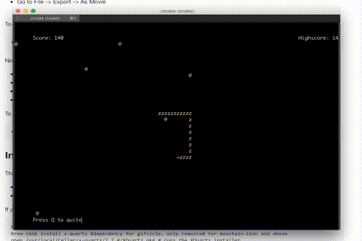

# SnakeC
The classic game of Snake in a terminal, written in C with ncurses.


This game is in series of game in which I try to reimplement classical games in
the terminal using nothing but straight C and ncurses.

# How to build
Simply run in the same folder:
```shell
make
```

# How to run
On UNIX-like operating systems use;
```shell
./snake
```

It can also be placed within your `$PATH` and run with simply `pong` from any folder.

Have not tried this on Windows, yet.

# License
The MIT License (MIT)
Copyright (c) 201 Alexander Lingtorp

Permission is hereby granted, free of charge, to any person obtaining a copy of this software and associated documentation files (the "Software"), to deal in the Software without restriction, including without limitation the rights to use, copy, modify, merge, publish, distribute, sublicense, and/or sell copies of the Software, and to permit persons to whom the Software is furnished to do so, subject to the following conditions:

The above copyright notice and this permission notice shall be included in all copies or substantial portions of the Software.

THE SOFTWARE IS PROVIDED "AS IS", WITHOUT WARRANTY OF ANY KIND, EXPRESS OR IMPLIED, INCLUDING BUT NOT LIMITED TO THE WARRANTIES OF MERCHANTABILITY, FITNESS FOR A PARTICULAR PURPOSE AND NONINFRINGEMENT. IN NO EVENT SHALL THE AUTHORS OR COPYRIGHT HOLDERS BE LIABLE FOR ANY CLAIM, DAMAGES OR OTHER LIABILITY, WHETHER IN AN ACTION OF CONTRACT, TORT OR OTHERWISE, ARISING FROM, OUT OF OR IN CONNECTION WITH THE SOFTWARE OR THE USE OR OTHER DEALINGS IN THE SOFTWARE.
